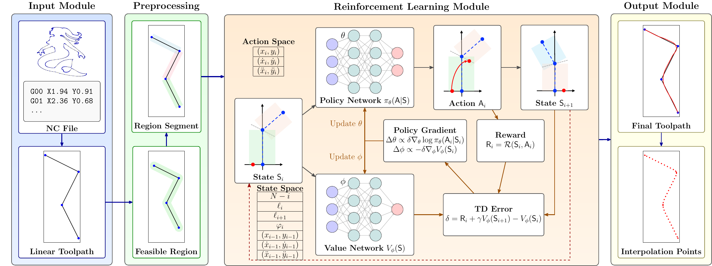

# KIRL (IEEE TII 2026)

[](#citation)

Official implementation of the paper:

> **Kinematics-Informed Reinforcement Learning for Unified Trajectory Optimization in CNC Interpolation**
>
> Jin Zhang, Mingyang Zhao, Bing Liu, Dong-Ming Yan, Xin Jiang
>
> *IEEE Transactions on Industrial Informatics*, 2026 (accepted).

<p align="center">
  
</p>

## Overview

**Corner smoothing and feedrate planning, decided jointly, one corner at a time.**

Conventional CNC interpolation first smooths the corners of a linear toolpath and then plans the feedrate along the fixed geometry. KIRL merges the two stages into a segment-level Markov decision process. At corner $i$ the policy chooses the junction kinematic state

$$\mathsf{A}_i = (\mathbf{q}_i,\ \mathbf{v}_i,\ \mathbf{a}_i),$$

and the segment between consecutive junctions is the minimum-jerk quintic with these boundary states, available in closed form for any duration $T$:

$$\mathbf{s}_i(t) = \sum_{k=0}^{5} \mathbf{c}_k t^k,\qquad \mathbf{C} = \mathbf{A}(T)^{-1}\mathbf{B},\qquad t\in[0,T].$$

The duration is the smallest one that keeps the segment inside the tolerance band and within the kinematic limits,

$$T_i^{\ast} = \min \big\lbrace T :\ \lvert d(t)\rvert \le \delta_{\max},\ \lVert\mathbf{v}(t)\rVert \le v_{\max},\ \lVert\mathbf{a}(t)\rVert \le a_{\max},\ \lVert\mathbf{j}(t)\rVert \le j_{\max} \big\rbrace,$$

found by a one-dimensional search, and the policy learns to minimize the total machining time $\sum_i T_i^{\ast}$.

**Highlights:**
- **Unified** — geometry and feedrate are optimized in a single decision process instead of two decoupled stages
- **Analytic primitives** — closed-form minimum-jerk quintics; feasibility reduces to a 1-D search over the duration
- **Zero-shot generalization** — one universal policy plans held-out toolpaths without retraining
- **Real-time** — 0.08–0.10 ms per junction on a single CPU core
- **Machine-validated** — planned trajectories executed in planar cutting experiments on a CNC machine

## Release Status

This is a partial release. The benchmark toolpaths, the trained universal policy, the inference-time planner and the scripts reproducing the paper's experiments will be released after the paper is formally published.

| Component | Status |
|---|---|
| Quintic motion primitives (`quintic.py`) | ✅ released |
| Benchmark toolpaths | ⏳ after publication |
| Trained universal policy and planner (Algorithm 1) | ⏳ after publication |
| Reproduction of Table III and the real-time timings | ⏳ after publication |

## Repository Structure

```
KIRL/
├── quintic.py        # Minimum-jerk quintic motion primitives
└── assets/           # Figures
```

## Installation

```bash
conda create -n kirl python=3.10 && conda activate kirl
pip install -r requirements.txt
```

## Data

The experiments use eight planar benchmark toolpaths designed by the authors (Digit 3, Mermaid, Unicorn, Simple Wave, Dolphin, Manta Ray, Golden Fish, Shark). The universal policy is trained on six of them; **Golden Fish** and **Shark** are held out and never seen during training. The toolpaths will be released together with the planner.

## Usage

### Quintic motion primitives

```python
from quintic import KinematicState, boundary_conditions, coefficients, sample

x0 = KinematicState([0.0, 0.0], [5.0, 0.0], [0.0, 0.0])   # position, velocity, acceleration
x1 = KinematicState([2.0, 0.1], [5.0, 1.0], [0.0, 0.0])
C = coefficients(boundary_conditions(x0, x1), T=0.4)       # (6, 2) coefficient matrix
pos, vel, acc, jerk = sample(C, T=0.4, dt=0.0005)          # dense profiles along the segment
```

In KIRL the policy chooses `x1` at every corner, and the planner searches for the smallest feasible `T`.

## Results

Zero-shot generalization of the universal policy (paper Table III). Kinematic limits: deviation ≤ 0.5 mm, velocity ≤ 10 mm/s, acceleration ≤ 100 mm/s², jerk ≤ 10000 mm/s³. `*` = held-out toolpath.

| Toolpath | Segments | $T_m$ (s) | max dev. (mm) | max vel. | max acc. | max jerk | Fallbacks |
|---|---|---|---|---|---|---|---|
| Digit 3 | 326 | 47.985 | 0.118 | 9.40 | 100.0 | 8655 | 0 |
| Mermaid | 604 | 89.574 | 0.129 | 9.40 | 100.0 | 9864 | 0 |
| Unicorn | 483 | 72.557 | 0.154 | 9.38 | 100.0 | 10000 | 0 |
| Simple Wave | 240 | 35.171 | 0.017 | 10.00 | 100.0 | 9967 | 0 |
| Dolphin | 267 | 39.306 | 0.076 | 9.39 | 100.0 | 10000 | 0 |
| Manta Ray | 330 | 48.207 | 0.097 | 9.40 | 100.0 | 10000 | 0 |
| Golden Fish* | 382 | 56.323 | 0.126 | 9.41 | 100.0 | 8192 | 0 |
| Shark* | 244 | 36.284 | 0.120 | 9.40 | 100.0 | 8451 | 0 |

Planning a full toolpath takes 21–53 ms on a single CPU core.

## Citation

```bibtex
@article{zhang2026kirl,
  title   = {Kinematics-Informed Reinforcement Learning for Unified Trajectory Optimization in CNC Interpolation},
  author  = {Zhang, Jin and Zhao, Mingyang and Liu, Bing and Yan, Dong-Ming and Jiang, Xin},
  journal = {IEEE Transactions on Industrial Informatics},
  year    = {2026},
  note    = {Accepted}
}
```

## License

This project is licensed under the MIT License. See [LICENSE](LICENSE) for details.
